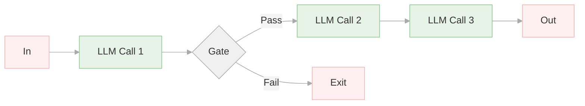
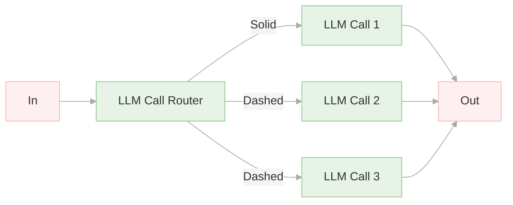
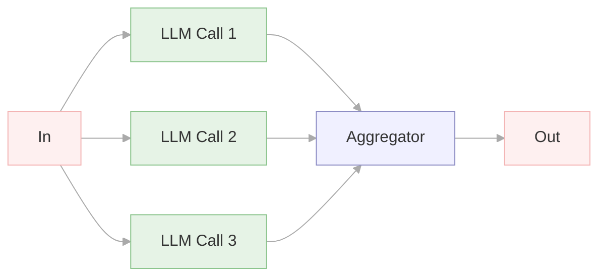
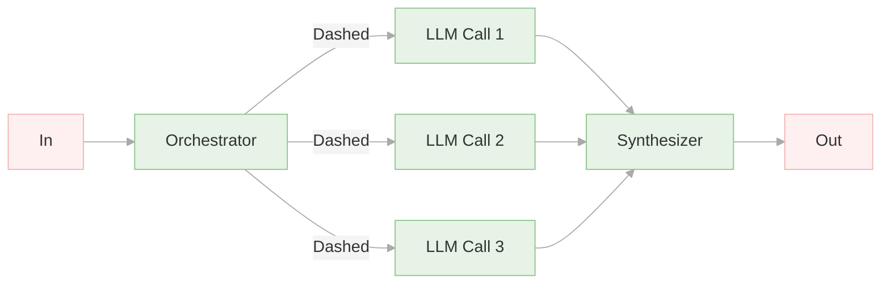
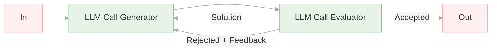
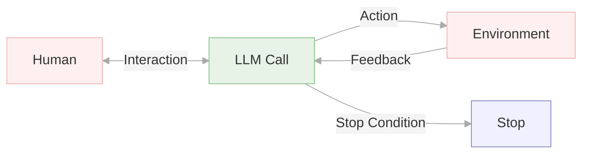

# AIエージェントのデザインパターン

Anthropicが提唱している5つのワークフロー

https://www.anthropic.com/engineering/building-effective-agents

## Prompt chaining:
**ポイント**
- タスクを複数のステップに分割し、各ステップでLLMを順次実行。
- 中間ステップでプログラムによるチェック（ゲート）を行い、処理が正しい方向に進んでいるか確認。
- 各LLMのタスクを単純化することで、精度向上と遅延のトレードオフを図る。

**シナリオ**
- マーケティングコピーを生成し、その後別の言語に翻訳する。
- ドキュメントのアウトラインを作成し、特定の基準を満たしているか確認した後、アウトラインに基づいてドキュメント全体を作成する。

## Routing
**ポイント**
- 入力内容を分類し、専門的な後続タスクに振り分ける。
- 懸念事項の分離と、より専門的なプロンプトの構築を可能にする。
- 入力の種類ごとに最適な処理を行うことで、全体のパフォーマンスを向上。

**シナリオ**
- 顧客サービスのお問い合わせを、一般的な質問、払い戻しリクエスト、技術サポートなどの異なるカテゴリに分類し、それぞれ適切な担当者やプロセスに振り分ける。
- 簡単な質問は、Claude 3.5 Haikuのようなより小さいモデルに、難しい質問は、Claude 3.5 Sonnetのようなより高性能なモデルにルーティングし、コストと速度を最適化する。

## Parallelization
**ポイント**
- LLMが同時にタスクを実行し、その出力をプログラムで集約する。
- セクション分割と投票の2つの主要なバリエーションが存在。
    - セクション分割：タスクを独立したサブタスクに分割し、並列で実行。
    - 投票：同じタスクを複数回実行し、多様な出力を得る。
- 複数の視点や試行が必要な場合、または速度向上のためにサブタスクを並列化できる場合に効果的。

**シナリオ**

1. セクション分割 (Sectioning)
   - シナリオ1：コンテンツモデレーション
    
        メイン処理と有害コンテンツチェックを並行して行い、安全性を確保。
   - シナリオ2：LLM評価

        複数の評価項目（正確性、流暢さなど）を並行して測定し、総合的なパフォーマンスを評価。

2. 投票 (Voting)

   - シナリオ1：コードレビュー

        複数のLLMでコードを分析し、脆弱性を検出。
    
   - シナリオ2：不適切コンテンツ判定
    
        複数のLLMでコンテンツを評価し、不適切かどうかを判断。

## Orchestrator-workers
**ポイント**
- 中央のLLMがタスクを動的に分解し、ワーカーLLMに委任し、結果を統合する。
- ブタスクが事前に予測できない複雑なタスクに適している（例：コーディング）。
- 並列化とは異なり、サブタスクは事前に定義されず、オーケストレーターが特定の入力に基づいて決定する。

**シナリオ**
- 複数のファイルに複雑な変更を加えるコーディング製品。
- 複数のソースから情報を収集・分析し、関連情報を探す検索タスク。

## Evaluator-optimizer
**ポイント**
- 一方のLLMが応答を生成し、もう一方のLLMがループ内で評価とフィードバックを提供する。
- 明確な評価基準があり、反復的な改善が測定可能な価値を提供する場合に特に効果的。
- 人間のライターが洗練されたドキュメントを作成する際の反復的な執筆プロセスに類似。

**シナリオ**
- 文学翻訳
  
    翻訳LLMが翻訳し、評価LLMがニュアンスなどを評価して改善案を提示。翻訳LLMが修正。

- 複雑な検索

    検索LLMが情報を収集し、評価LLMが情報の網羅性などを評価して追加検索の必要性を判断。

## Agents
- 複雑な入力を理解し、推論と計画を行い、ツールを確実に使用し、エラーから回復する能力が成熟したLLMとして登場。
- 人間とのコマンドや対話から作業を開始し、タスクが明確になると、エージェントは独立して計画・実行し、必要に応じて人間に追加情報や判断を求める。
- 実行中、エージェントは各ステップで環境から「真実の根拠」を取得し（ツール呼び出しの結果やコード実行など）、進捗状況を評価することが重要。
- チェックポイントやブロッカーに遭遇した場合に、人間のフィードバックのために一時停止できる。
- ツールセットとそのドキュメントを明確かつ慎重に設計することが重要。

