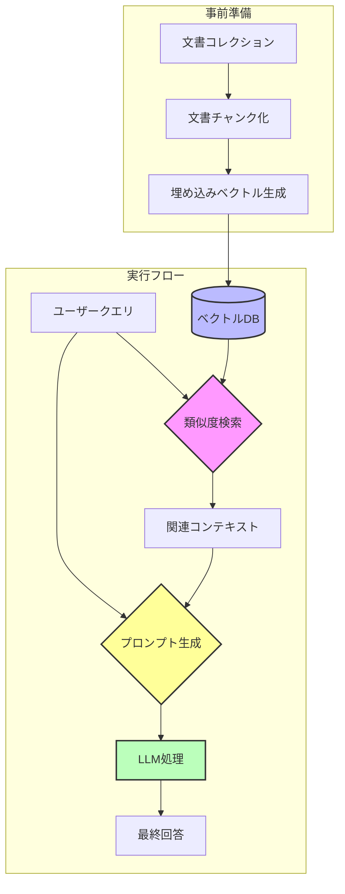
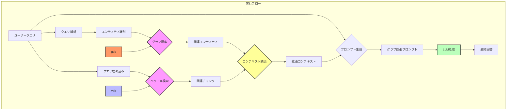
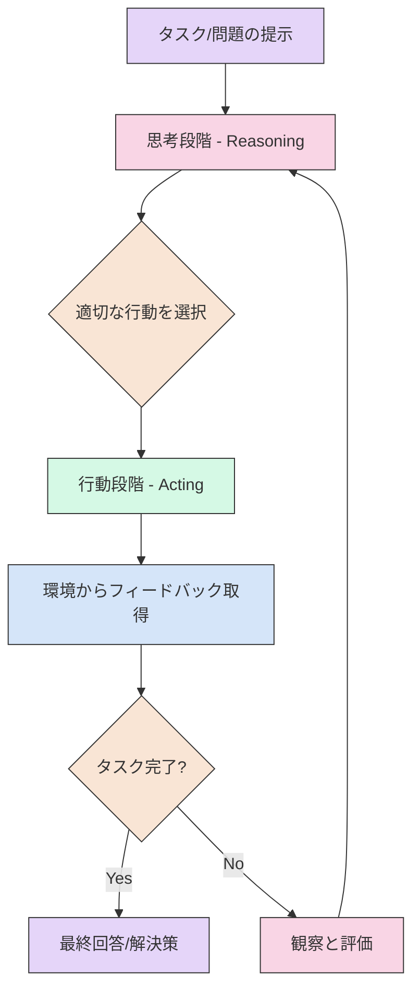
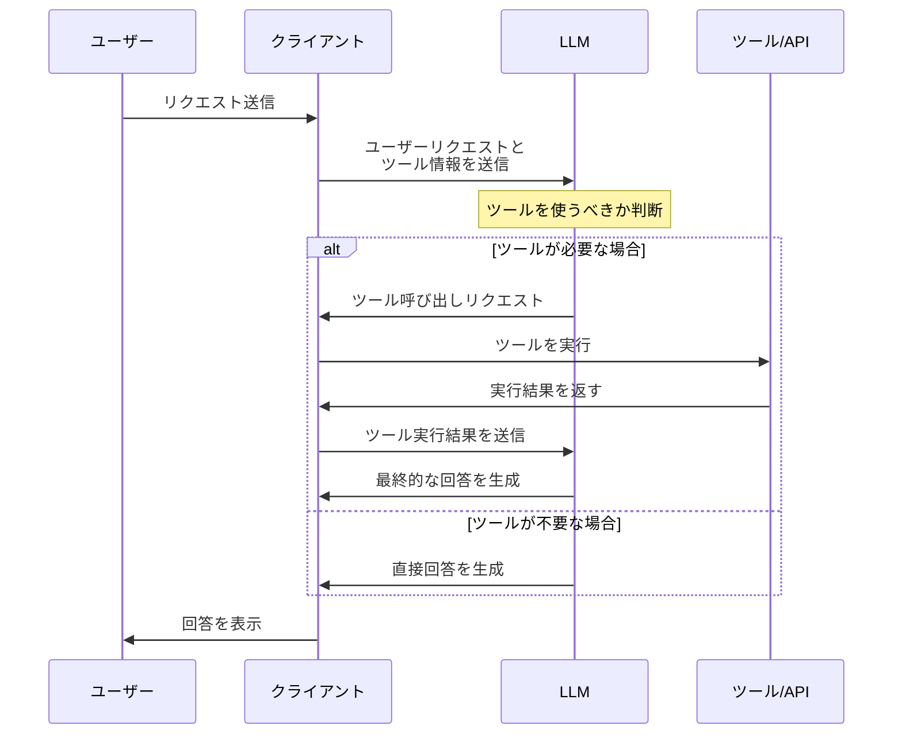
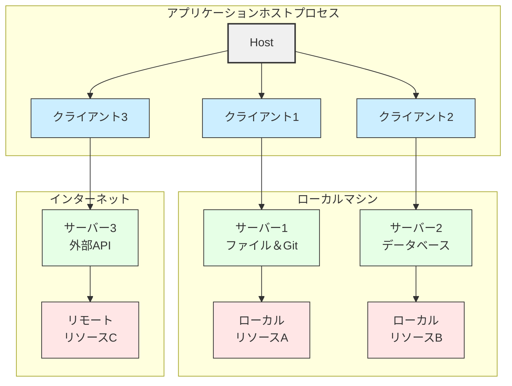

# AIエージェント入門
はじめに
この資料は、AIエージェントの基本的な概念を理解するための入門書です。AIエージェントとは、人間の指示に基づいて、自律的にタスクを実行するソフトウェアのことです。この資料では、AIエージェントの実現に欠かせない要素技術であるLLM、RAG、CoT、そしてTool Callingについて、説明した後、MCPについてデモを交えて説明します。

## 1. LLM（Large Language Model：大規模言語モデル）とは？

LLMは、大量のテキストデータを学習し、人間が書いた文章を理解したり、生成したりできるAIモデルです。

### LLMができること

*   **テキスト分類:** 文章をカテゴリー分けする（例：ニュース記事を「スポーツ」「経済」などに分類）
*   **感情分析:** 文章から感情を読み取る（例：レビューがポジティブかネガティブかを判断）
*   **情報抽出:** 文章から必要な情報を取り出す（例：ニュース記事から人名、日付、場所を抽出）
*   **文章要約:** 長い文章を短くまとめる
*   **テキスト生成:** 新しい文章を自動で作成する（例：ブログ記事、小説、詩など）
*   **質問応答:** 質問に対して適切な回答を生成する
*   **画像、音声、動画などの出力:** 最近では、テキストだけでなく、画像や音声などのデータも生成できるようになっています。

### LLMの仕組み

LLMは、以下のステップで文章を理解し、生成します。

1.  **トークン化:** 文章を意味を持つ最小単位（トークン）に分割します。（例：「私は猫が好きです。」→「私」「は」「猫」「が」「好き」「です」「。」）
2.  **ベクトル化:** トークンを数値（ベクトル）に変換します。これにより、コンピュータが単語の意味や関係性を理解できるようになります。
3.  **ニューラルネットワーク:** ベクトル化されたデータを使って、文章の特徴やパターンを学習します。
4.  **文脈理解:** 学習した情報をもとに、文章全体の意味を理解します。
5.  **デコード:** 理解した内容から、新しい文章を生成します。

### LLMができないこと

LLMは学習データに基づいて文章を生成するため、学習していない情報については、信憑性の低い情報（ハルシネーション）を生成してしまうことがあります。つまり、知ったかぶりをして、それらしい嘘をついてしまうことがあるのです。

## 2. RAG（Retrieval-Augmented Generation）について

RAGは、LLMが持つ知識だけでなく、外部のデータベースやWebサイトから情報を検索して、文章生成に利用する技術です。

### RAGの核心的なデータフロー

1. **事前準備（インデックス作成）**:
   - 文書コレクションをチャンク（断片）に分割
   - 各チャンクを埋め込みモデルで意味ベクトルに変換
   - ベクトルデータベースに保存

2. **実行フロー**:
   - ユーザークエリを同じ埋め込みモデルでベクトル化
   - ベクトルDBで類似度検索を実行し、関連性の高いコンテキストを取得
   - ユーザークエリと取得したコンテキストを組み合わせて拡張プロンプトを作成
   - この拡張プロンプトをLLMに入力し、最終回答を生成

LLMは、この拡張された情報を元に回答を生成するため、単独で回答するよりも正確な情報を提供できるようになります。

RAGの主な価値は、このようにクエリ時に関連する外部知識を動的に取得し、LLMの入力コンテキストを「拡張」することにあります。

**RAGの流れ**

### RAGの欠点
RAGシステムでは、検索段階においてLLMのように文脈に応じてベクトルを動的に補完する機構(self attention)は存在しません。埋め込みモデルが単語やフレーズの意味を完全に捉えられない場合や、多義語の扱いに課題がある場合に、関連性の低い情報が検索されることがあります。

例として、「バンク」という単語を含む情報を検索し、その情報に基づいて文章を生成するケースを考えます。検索結果には、「銀行（financial bank）」と「土手（river bank）」の両方の意味の情報が含まれているとします。この時、RAGは文脈に応じて「バンク」の意味を適切に選択できない場合があります。例えば、金融に関する文章を生成する必要があるのに、土手に関する情報を参照してしまい、意味の通じない文章を生成してしまうことがあります。

### GraphRAG（グラフベースRAG）
文書間の関係をグラフ構造として表現し、従来のRAGの弱点である、文脈を考慮した情報検索を強化します。

**メリット**
文書間の関連性や階層関係を明示的に扱える
複雑な質問に対して関連情報をグラフ探索で取得可能
エンティティ間の関係性を考慮した回答生成

## 3. CoT(Chain of Thought)とは？
CoTは、LLMが複雑な問題を解決する際に、段階的な推論プロセスを明示的に示す手法です。

**ポイント**
- LLMに「考える」プロセスを促す概念
- パターン認識ではなく、論理的な推論に基づいた回答を生成させる
- LLMの能力を最大限に引き出し、より複雑な問題解決を可能にする

言い換え：CoTは、LLMが問題を解く過程を、まるで人間のように段階的に示すことで、より高度な問題解決を可能にするアプローチです。

### 実装方法

**1. Zero-shot CoT**

* **説明:**
    * これは、LLMに追加の例を与えずに、プロンプト内で「段階的に考えて」といった指示を与えることで、思考の連鎖を促す手法です。
    * LLMは、事前に学習した知識と推論能力のみに基づいて、段階的な思考プロセスを生成します。
* **具体例:**
    * **タスク:**「ジョンは庭にリンゴの木を5本植えました。それぞれの木から3個のリンゴが収穫できました。ジョンは全部で何個のリンゴを収穫しましたか？」
    * **プロンプト:**「段階的に考えて、答えを出してください。」
    * **LLMの応答例:**
        * 「まず、リンゴの木が5本あります。」
        * 「次に、それぞれの木から3個のリンゴが収穫できます。」
        * 「したがって、5本×3個で、15個のリンゴを収穫しました。」
        * 「答えは15個です。」
    * この例では、LLMは追加の例を与えられずに、プロンプトの指示のみに基づいて、段階的な思考プロセスを生成し、正解を導き出しています。

**2. Few-shot CoT**

* **説明:**
    * これは、LLMに少数の例（数個のペア）を与えてから、同様のタスクを実行させる手法です。
    * LLMは、与えられた例から段階的な思考のパターンを学習し、新しい入力に対して同様の思考プロセスを生成します。
* **具体例:**
    * **タスク:**「マリアは8個のクッキーを持っていました。彼女は友達に2個のクッキーをあげました。マリアは今、何個のクッキーを持っていますか？」
    * **プロンプト:**
        * 「例：トムは10個のボールを持っていました。彼は3個のボールをなくしました。トムは今、何個のボールを持っていますか？答え：まず、10個から3個を引きます。したがって、トムは7個のボールを持っています。」
        * 「マリアは8個のクッキーを持っていました。彼女は友達に2個のクッキーをあげました。マリアは今、何個のクッキーを持っていますか？答え：」
    * **LLMの応答例:**「まず、8個から2個を引きます。したがって、マリアは6個のクッキーを持っています。」
    * この例では、LLMは与えられた例から引き算の段階的な思考パターンを学習し、新しい問題に対して同様の思考プロセスを生成しています。

**3. タスク分解と段階的な内部対話**

* **説明:**
    * これは、複雑なタスクを複数のサブタスクに分解し、LLMが内部的に段階的な思考プロセスを実行する手法です。
    * LLMは、各サブタスクで中間的な結果を生成し、それらを組み合わせて最終的な回答を構築します。
* **具体例:**
    * **タスク:**「東京から大阪までの最適な新幹線旅行プランを作成してください。予算は3万円、期間は2日間です。」
    * **LLMの内部処理:**
        * サブタスク1：東京から大阪までの新幹線の料金を調べる。
        * サブタスク2：大阪での宿泊施設の料金を調べる。
        * サブタスク3：大阪での観光スポットと交通手段を調べる。
        * サブタスク4：予算と期間に基づいて、最適な旅行プランを組み立てる。
    * **LLMの応答例:**「1日目は、東京駅から新幹線で大阪駅へ移動し、大阪城を観光します。夜は、道頓堀周辺のホテルに宿泊します。2日目は、通天閣を観光し、新幹線で東京駅へ戻ります。新幹線の料金は〇〇円、宿泊料金は△△円、観光と交通費は□□円で、合計で29000円です。」
    * この例では、LLMは複雑な旅行プラン作成タスクを複数のサブタスクに分解し、それぞれのサブタスクで必要な情報を収集し、それらを組み合わせて最終的な旅行プランを生成しています。この時内部で各サブタスクごとに内部で対話のような処理が行われていると考えられます。

**各実装の比較**

```mermaid
flowchart TD
    subgraph "Zero-shot CoT"
        A1[タスク] --> A2["プロンプト: '段階的に考えて'"]
        A2 --> A3[LLMが段階的思考プロセスを生成]
        A3 --> A4[最終的な回答]
    end

    subgraph "Few-shot CoT"
        B1[タスク] --> B2[少数の例を含むプロンプト]
        B2 --> B3[LLMが例から思考パターンを学習]
        B3 --> B4[新しい入力に対して類似の思考プロセスを適用]
        B4 --> B5[最終的な回答]
    end

    subgraph "タスク分解と段階的な内部対話"
        C1[複雑なタスク] --> C2[複数のサブタスクに分解]
        C2 --> C3[サブタスク1: 中間結果を生成]
        C2 --> C4[サブタスク2: 中間結果を生成]
        C2 --> C5[サブタスク3: 中間結果を生成]
        C3 & C4 & C5 --> C6[中間結果を組み合わせ]
        C6 --> C7[最終的な回答]
    end

    style A1 fill:#f9d5e5,stroke:#333
    style B1 fill:#eeeeee,stroke:#333
    style C1 fill:#d5f9e5,stroke:#333
    
    style A2 fill:#f9d5e5,stroke:#333
    style B2 fill:#eeeeee,stroke:#333
    style C2 fill:#d5f9e5,stroke:#333
    
    style A3 fill:#f9d5e5,stroke:#333
    style B3 fill:#eeeeee,stroke:#333
    style C3 fill:#d5f9e5,stroke:#333
    style C4 fill:#d5f9e5,stroke:#333
    style C5 fill:#d5f9e5,stroke:#333
    
    style A4 fill:#f9d5e5,stroke:#333
    style B4 fill:#eeeeee,stroke:#333
    style C6 fill:#d5f9e5,stroke:#333
    
    style B5 fill:#eeeeee,stroke:#333
    style C7 fill:#d5f9e5,stroke:#333
```

### ThinkingモデルとFlashモデル

「Thinkingモデル」と「Flashモデル」は、どちらもLLMを基盤としていますが、重視する点が異なります。

**主な違い:**

*   **Thinkingモデル：**
    *   複雑な問題解決・推論に重点。
    *   CoTのように、段階的な思考プロセスを重視し、可視化する。
*   **Flashモデル：**
    *   高速な処理・効率性に重点。
    *   思考プロセスを省略し、迅速な応答を可能にする。

**例：**

*   Googleの「Gemini 2.0 Flash Thinking」は、思考プロセスを可視化するThinkingモデルの一例。

## 4. ReAct(Reasoning and Acting)
ReActは大規模言語モデル（LLM）やAIシステムが問題解決を行う際の効果的な手法で、以下のステップで構成されています：
1. **タスク/問題の提示**: 解決すべき問題や達成すべきタスクが提示されます

2. **思考段階（Reasoning）**: システムが問題を分析し、可能な解決策や次に取るべき行動について推論します

3. **行動選択**: 推論に基づいて、最適な行動を選択します

4. **行動段階（Acting）**: 選択した行動を実行します（例：情報検索、計算、データ変換など）

5. **フィードバック取得**: 行動の結果から環境からのフィードバックを得ます

6. **タスク完了判断**: 目標が達成されたかどうかを評価します
   - 完了している場合：最終的な回答や解決策を提示
   - 未完了の場合：観察と評価を行い、再び思考段階に戻ります

ReActは特に複雑な問題解決や推論が必要なタスクにおいて、単純な「思考のみ」あるいは「行動のみ」のアプローチよりも優れた結果をもたらすことが示されています。このプロセスにより、AIシステムは単なる知識の検索や推論だけでなく、外部環境と相互作用しながら段階的に問題を解決することができます。

## 5. Tool Calling

Tool Calling（ツール呼び出し）は、大規模言語モデル（LLM）が外部のツールやAPIを呼び出し、その結果を自身の応答に組み込む機能です。これにより、LLMはより複雑なタスクを実行したり、最新の情報に基づいた回答を提供したりできるようになります。

**Tool Callingの仕組み**

1.  **ツールの定義:**
    * 開発者は、LLMが利用できるツールとその機能を定義します。これには、ツールの名前、説明、必要なパラメータなどが含まれます。
2.  **LLMによるツール呼び出しの判断:**
    * ユーザーからの質問や指示に基づいて、LLMはどのツールを呼び出すべきかを判断します。
    * LLMは、必要なパラメータを抽出し、ツールを呼び出すためのリクエストを生成します。
3.  **ツールの実行と結果の取得:**
    * LLMからのリクエストを受け取ったツールは、実行され、結果がLLMに返されます。
4.  **結果の統合と応答の生成:**
    * LLMは、ツールの実行結果を自身の知識と統合し、ユーザーへの最終的な応答を生成します。

**Tool Callingの活用例**

* **最新情報の取得:**
    * 天気予報、株価、ニュースなどの最新情報をAPI経由で取得し、ユーザーに提供します。
* **外部サービスとの連携:**
    * カレンダーアプリと連携して予定を登録したり、地図アプリと連携して経路を検索したりします。
* **複雑なタスクの実行:**
    * 複数のツールを組み合わせることで、複雑なタスク（例：旅行プランの作成、商品の比較検討）を実行します。
* **データベースとの連携:**
    * データベースと連携することにより、データベース内の情報を検索し、回答に利用する。

**Tool Callingの利点**

* **LLMの能力拡張:**
    * LLMが外部ツールを利用することで、自身の知識や能力を拡張できます。
* **リアルタイムな情報提供:**
    * 常に最新の情報に基づいた回答を提供できます。
* **多様なタスクへの対応:**
    * より複雑で多様なタスクを実行できるようになります。
* **ユーザー体験の向上:**
    * 外部サービスとの連携で、より便利で自然なユーザー体験を提供できます。

Tool Callingは、LLMの可能性を大きく広げる重要な技術であり、今後さまざまな分野での活用が期待されています。

Tool Callingの流れ

## 6. MCP(Model Context Protocol)
Model Context Protocol (MCP)は、最新のAIアシスタントが外部データにアクセスする問題を解決するために開発されました。

現代のAIアシスタントが直面する重要な課題、それは外部データへのアクセスです。AIモデルはどれほど優れていても、学習したデータの範囲内でしか知識を持ち合わせていません。本当に役立つ、状況に応じた回答を提供するには、データベースやコードリポジトリ、クラウドストレージ、その他のアプリケーションなど、さまざまな情報源からリアルタイムデータを取得できる仕組みが必要です。MCPはそのための架け橋となるのです。

**MCPの流れ** 

たとえるなら、AIは優秀な学生のようなものですが、限られた蔵書しかない図書館に閉じ込められている状態です。MCPは、その学生に図書館カードとインターネット接続を与えるようなもので、最初に与えられた本の範囲を超えて、広大な情報の海を探索し学べるようにします。

# 余談（ローカルLLM）
SLM（小規模言語モデル）の能力がLLM（大規模言語モデル）並みに上昇しているという話。そこそこのPC（20-30万）でクローズドなエージェントシステムが実現できる。
https://www.mag2.com/p/news/639442

# 余談（科学者向けAI AI co-scientist）
生物、医薬科学者向けのサービス。仮説、検証を繰り返し、実証実験を行ってくれる。
https://gigazine.net/news/20250317-googles-ai-cracked-superbug-problem/

