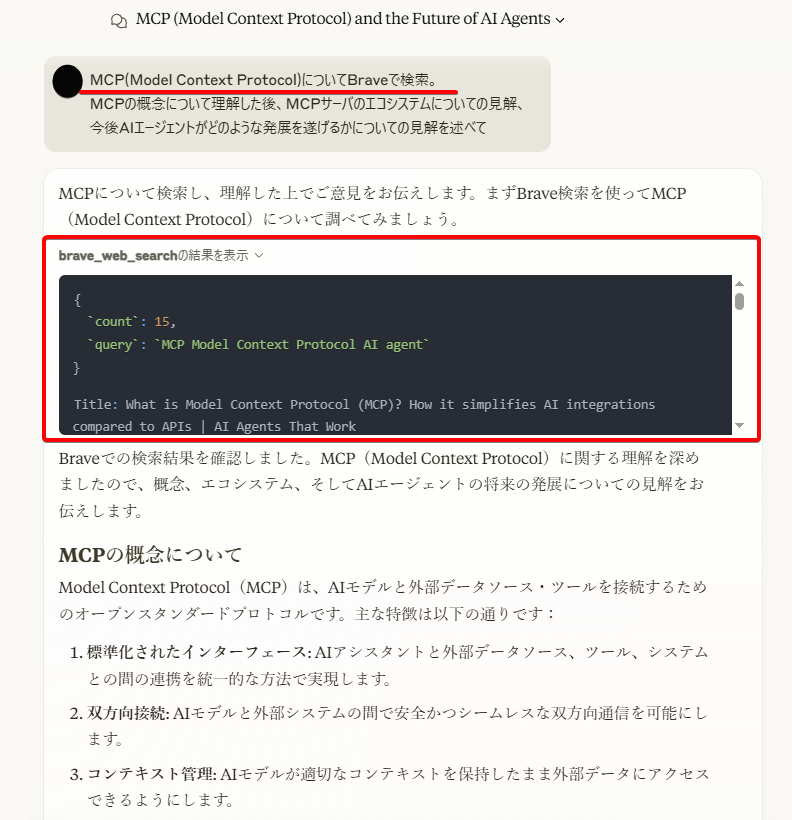
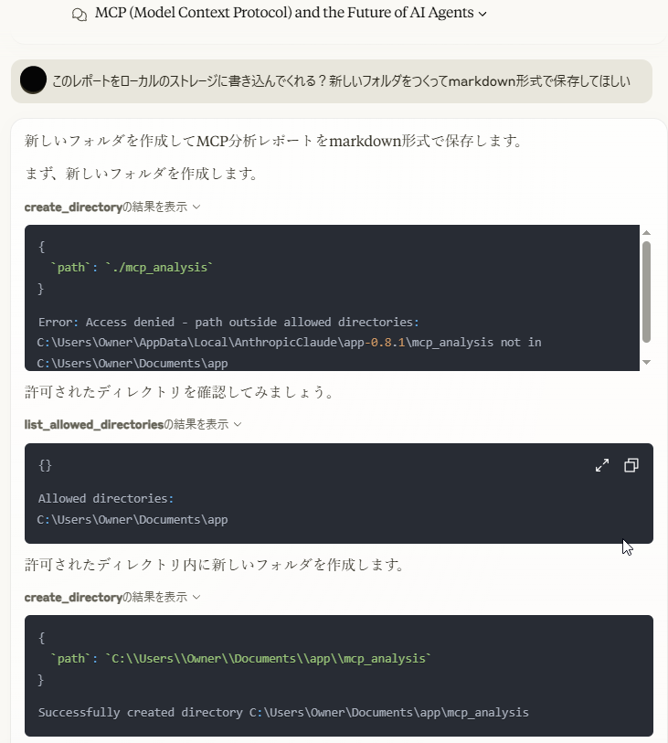

# MCPサーバのギャラリー

* **Githubのリポジトリ一覧**
MCPサーバのGitリポジトリ一覧。なんでもある。
https://github.com/punkpeye/awesome-mcp-servers/blob/main/README.md

* **Smithery**
設定ファイルのレシピ一覧。アプリケーション側で設定ファイルを追加することで自動でnode.jsでMCPサーバを起動してくれる。
https://smithery.ai/

* **Glama**
MCPサーバを管理するプラットフォーム？Docker Hubみたいなもの。
https://glama.ai/mcp/servers

# MCPのデモ
Calude DesktopでMCPサーバのデモを実施する。

シナリオ
- LLMが学習していない情報をインターネットで検索（Brave Search Server）
- その情報を基にレポート作成
- 作成したレポートをローカルのファイルに書き込む（FileSystem Server）

**学習していない情報をBraveで検索する**

**ローカルのファイルにレポートを作成**

