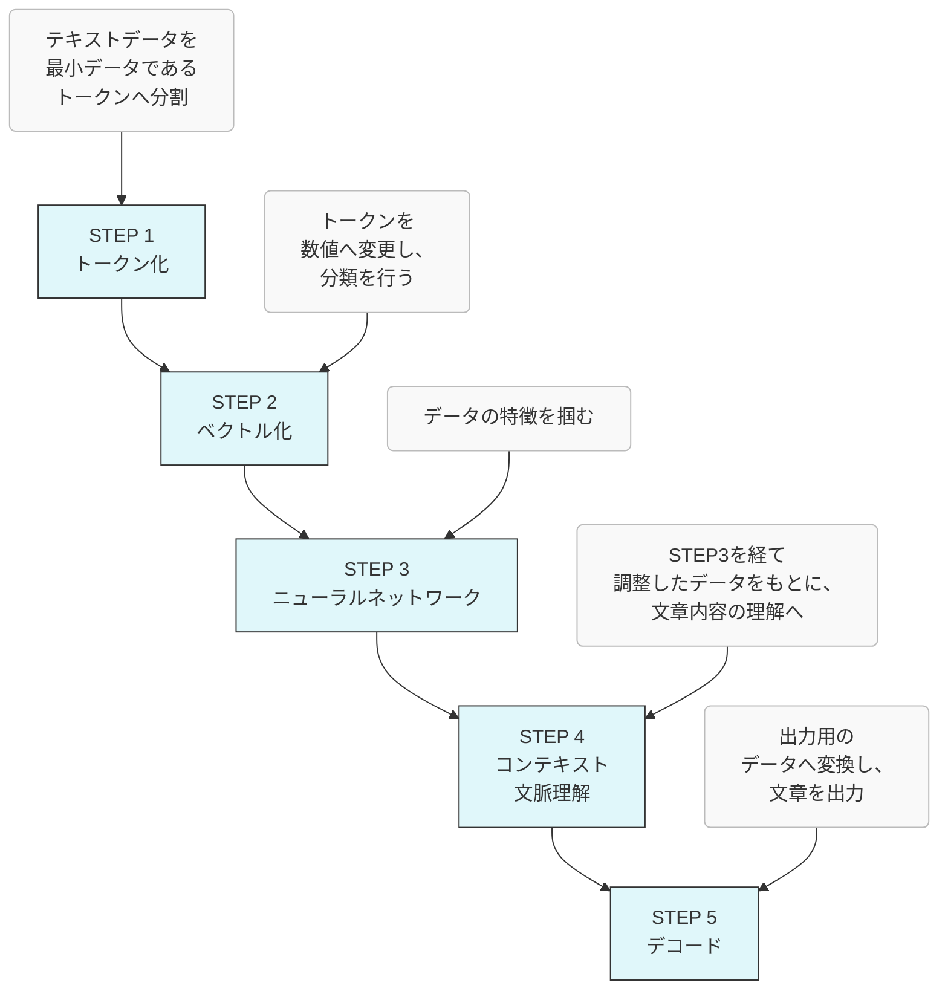
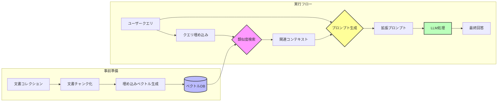
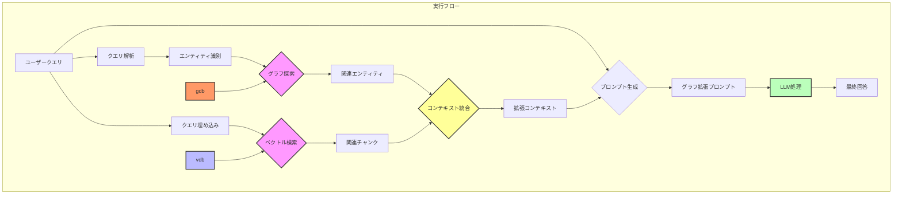
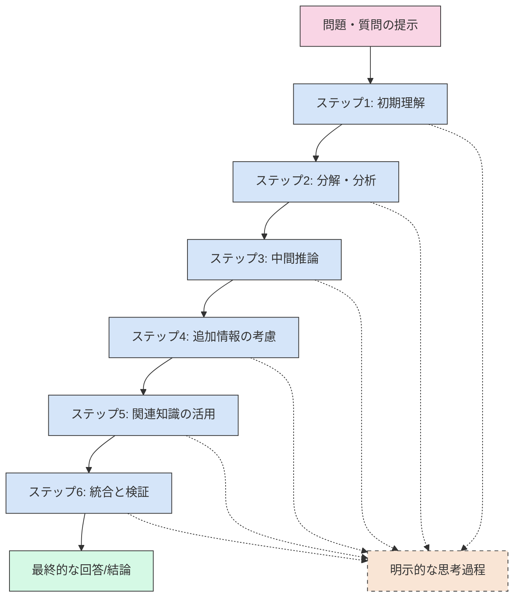
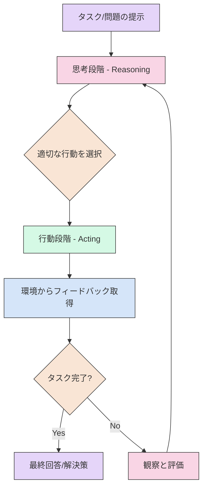
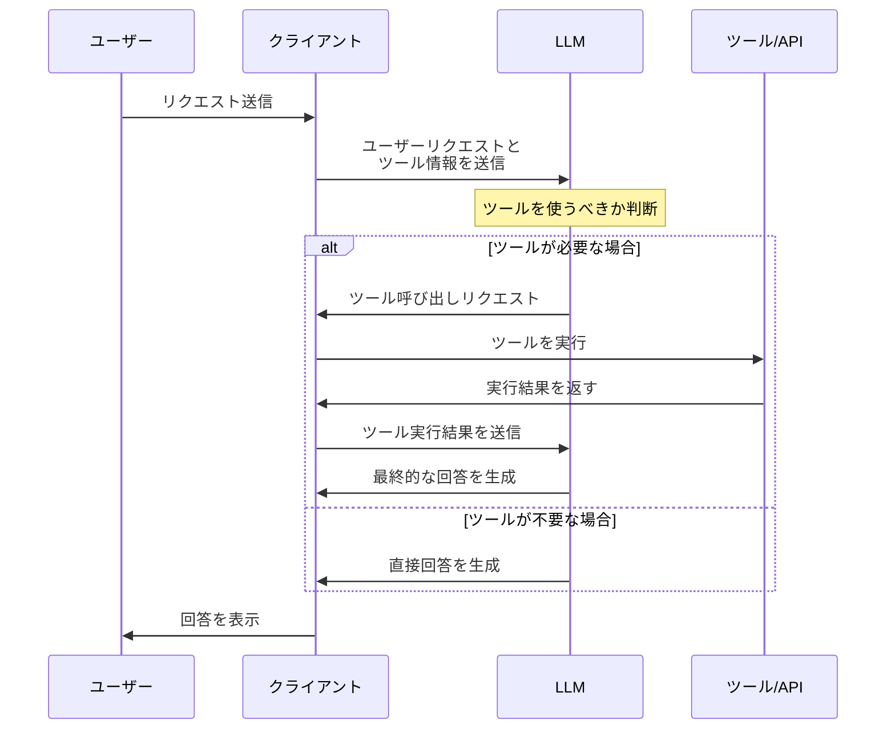
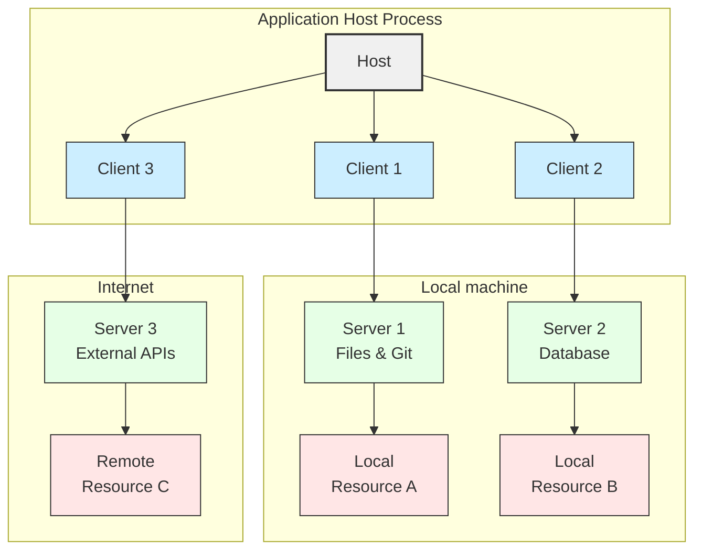
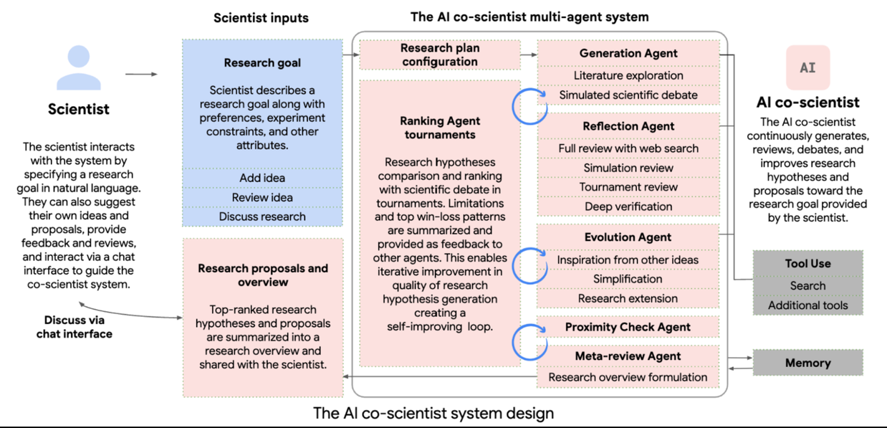

# LLM(Large Language Model)
LLMはファインチューニングすることによって、テキスト分類や感情分析、情報抽出、文章要約、テキスト生成、質問応答といった、さまざまな自然言語処理タスクに適応可能となります。
最近では、画像、音声、動画などのデータも出力可能になっています。

# RAG（Retrieval-Augmented Generation）について

## RAGの核心的なデータフロー

1. **事前準備（インデックス作成）**:
   - 文書コレクションをチャンク（断片）に分割
   - 各チャンクを埋め込みモデルで意味ベクトルに変換
   - ベクトルデータベースに保存

2. **実行フロー**:
   - ユーザークエリを同じ埋め込みモデルでベクトル化
   - ベクトルDBで類似度検索を実行し、関連性の高いコンテキストを取得
   - **重要なポイント**: ユーザークエリと取得したコンテキストを組み合わせて拡張プロンプトを作成
   - この拡張プロンプトをLLMに入力し、最終回答を生成

LLMは、この拡張された情報を元に回答を生成するため、単独で回答するよりも正確な情報を提供できるようになります。

RAGの主な価値は、このようにクエリ時に関連する外部知識を動的に取得し、LLMの入力コンテキストを「拡張」することにあります。

RAGの流れ

## シンプルなRAGの欠点
RAGシステムでは、検索段階においてLLMのように文脈に応じてベクトルを動的に補完する機構(self attention)は存在しません。埋め込みモデルが単語やフレーズの意味を完全に捉えられない場合や、多義語の扱いに課題がある場合に、関連性の低い情報が検索されることがあります。

例として、「バンク」という単語を含む情報を検索し、その情報に基づいて文章を生成するケースを考えます。検索結果には、「銀行（financial bank）」と「土手（river bank）」の両方の意味の情報が含まれているとします。この時、RAGは文脈に応じて「バンク」の意味を適切に選択できない場合があります。例えば、金融に関する文章を生成する必要があるのに、土手に関する情報を参照してしまい、意味の通じない文章を生成してしまうことがあります。

## GraphRAG（グラフベースRAG）

特徴:  
文書間の関係をグラフ構造として表現

メリット: 
文書間の関連性や階層関係を明示的に扱える
複雑な質問に対して関連情報をグラフ探索で取得可能
エンティティ間の関係性を考慮した回答生成

実装例: Metaphor社の「Memory Graph」、Neo4jとLLMの連携システムなど

# CoT(Chain of Thought)
Chain of Thought（CoT、思考の連鎖）は、大規模言語モデル（LLM）や人工知能が複雑な問題を解決する際に、段階的な推論プロセスを明示的に示す手法です。この図は、そのプロセスを表しています：

1. **問題・質問の提示**: まず解決すべき問題や回答すべき質問が提示されます

2. **ステップ1: 初期理解**: 問題の基本的な理解と解釈を行います

3. **ステップ2: 分解・分析**: 複雑な問題をより小さな部分問題に分解します

4. **ステップ3: 中間推論**: 各部分問題に対して推論を行い、中間的な結論を導きます

5. **ステップ4: 追加情報の考慮**: 関連する追加情報や制約条件を検討します

6. **ステップ5: 関連知識の活用**: 背景知識や関連する概念を適用します

7. **ステップ6: 統合と検証**: 中間結論を統合し、全体の整合性を検証します

8. **最終的な回答/結論**: すべての思考ステップを経て最終的な回答を導き出します

CoTの特徴は、これらの思考過程を「明示的に表現する」点にあります（図の破線で示された部分）。AIモデルが「どのように考えているか」を示すことで、以下の利点があります：

- 複雑な推論を必要とする問題での精度向上
- モデルの思考過程の透明性確保
- 誤りの早期発見と修正の機会提供
- 人間の自然な思考プロセスに近い形での問題解決

CoTは特に算数、論理的推論、多段階の思考を要する問題解決において、単に結論だけを出力するよりも高い正確性を示すことが研究で明らかになっています。

## CoTの概念

CoTは、LLMに「考える」プロセスを促すための概念であり、その実現方法は多岐にわたります。
重要なのは、LLMが単にパターン認識に基づいて回答を生成するのではなく、論理的な推論に基づいて回答を生成するように促すことです。
CoTは、LLMの能力を最大限に引き出し、より複雑な問題解決を可能にするための重要なアプローチと言えます。

**1. Zero-shot CoT**

* **説明:**
    * これは、LLMに追加の例を与えずに、プロンプト内で「段階的に考えて」といった指示を与えることで、思考の連鎖を促す手法です。
    * LLMは、事前に学習した知識と推論能力のみに基づいて、段階的な思考プロセスを生成します。
* **具体例:**
    * **タスク:**「ジョンは庭にリンゴの木を5本植えました。それぞれの木から3個のリンゴが収穫できました。ジョンは全部で何個のリンゴを収穫しましたか？」
    * **プロンプト:**「段階的に考えて、答えを出してください。」
    * **LLMの応答例:**
        * 「まず、リンゴの木が5本あります。」
        * 「次に、それぞれの木から3個のリンゴが収穫できます。」
        * 「したがって、5本×3個で、15個のリンゴを収穫しました。」
        * 「答えは15個です。」
    * この例では、LLMは追加の例を与えられずに、プロンプトの指示のみに基づいて、段階的な思考プロセスを生成し、正解を導き出しています。

**2. Few-shot CoT**

* **説明:**
    * これは、LLMに少数の例（数個のペア）を与えてから、同様のタスクを実行させる手法です。
    * LLMは、与えられた例から段階的な思考のパターンを学習し、新しい入力に対して同様の思考プロセスを生成します。
* **具体例:**
    * **タスク:**「マリアは8個のクッキーを持っていました。彼女は友達に2個のクッキーをあげました。マリアは今、何個のクッキーを持っていますか？」
    * **プロンプト:**
        * 「例：トムは10個のボールを持っていました。彼は3個のボールをなくしました。トムは今、何個のボールを持っていますか？答え：まず、10個から3個を引きます。したがって、トムは7個のボールを持っています。」
        * 「マリアは8個のクッキーを持っていました。彼女は友達に2個のクッキーをあげました。マリアは今、何個のクッキーを持っていますか？答え：」
    * **LLMの応答例:**「まず、8個から2個を引きます。したがって、マリアは6個のクッキーを持っています。」
    * この例では、LLMは与えられた例から引き算の段階的な思考パターンを学習し、新しい問題に対して同様の思考プロセスを生成しています。

**3. タスク分解と段階的な内部対話**

* **説明:**
    * これは、複雑なタスクを複数のサブタスクに分解し、LLMが内部的に段階的な思考プロセスを実行する手法です。
    * LLMは、各サブタスクで中間的な結果を生成し、それらを組み合わせて最終的な回答を構築します。
* **具体例:**
    * **タスク:**「東京から大阪までの最適な新幹線旅行プランを作成してください。予算は3万円、期間は2日間です。」
    * **LLMの内部処理:**
        * サブタスク1：東京から大阪までの新幹線の料金を調べる。
        * サブタスク2：大阪での宿泊施設の料金を調べる。
        * サブタスク3：大阪での観光スポットと交通手段を調べる。
        * サブタスク4：予算と期間に基づいて、最適な旅行プランを組み立てる。
    * **LLMの応答例:**「1日目は、東京駅から新幹線で大阪駅へ移動し、大阪城を観光します。夜は、道頓堀周辺のホテルに宿泊します。2日目は、通天閣を観光し、新幹線で東京駅へ戻ります。新幹線の料金は〇〇円、宿泊料金は△△円、観光と交通費は□□円で、合計で29000円です。」
    * この例では、LLMは複雑な旅行プラン作成タスクを複数のサブタスクに分解し、それぞれのサブタスクで必要な情報を収集し、それらを組み合わせて最終的な旅行プランを生成しています。この時内部で各サブタスクごとに内部で対話のような処理が行われていると考えられます。

# ThinkingモデルとFlashモデルについて
最近の「Thinkingモデル」と「Flashモデル」は、基盤となるLLM自体は同じであることが多いですが、その入力処理と出力生成のフローに違いがあります。

**主な違い**

* **思考プロセスの重視:**
    * 「Thinkingモデル」は、より複雑な問題解決や推論に重点を置いており、その過程を重視します。
    * CoT（Chain-of-Thought）のように、段階的な思考プロセスを内部で実行し、その過程を可視化したり、出力に含めたりすることが特徴です。
    * これにより、人間がどのように考えているかに近い形で、より深い理解や洞察を得ることができます。
* **処理速度と効率性:**
    * 「Flashモデル」は、より高速な処理と効率性を重視します。
    * 複雑な思考プロセスを省略したり、最適化したりすることで、迅速な応答や大量のデータ処理を可能にします。
    * リアルタイムな応答や、大量の情報を処理するタスクに適しています。
* **内部のやり取り:**
    * 「Thinkingモデル」は、複数の内部的なやり取り（例えば、自己対話や反復的な推論）を行うことで、より深い思考を可能にします。
    * 「Flashモデル」は、それらのプロセスを省略し、直接的な推論や応答に焦点を当てます。

**具体例**

* Googleの「Gemini 2.0 Flash Thinking」は、「Thinkingモデル」の代表的な例です。
    * このモデルは、思考プロセスを「Thoughts」として可視化し、人間がAIの思考過程を理解できるように設計されています。

# ReAct(Reasoning and Acting)
ReActは大規模言語モデル（LLM）やAIシステムが問題解決を行う際の効果的な手法で、以下のステップで構成されています：
1. **タスク/問題の提示**: 解決すべき問題や達成すべきタスクが提示されます

2. **思考段階（Reasoning）**: システムが問題を分析し、可能な解決策や次に取るべき行動について推論します

3. **行動選択**: 推論に基づいて、最適な行動を選択します

4. **行動段階（Acting）**: 選択した行動を実行します（例：情報検索、計算、データ変換など）

5. **フィードバック取得**: 行動の結果から環境からのフィードバックを得ます

6. **タスク完了判断**: 目標が達成されたかどうかを評価します
   - 完了している場合：最終的な回答や解決策を提示
   - 未完了の場合：観察と評価を行い、再び思考段階に戻ります

ReActは特に複雑な問題解決や推論が必要なタスクにおいて、単純な「思考のみ」あるいは「行動のみ」のアプローチよりも優れた結果をもたらすことが示されています。このプロセスにより、AIシステムは単なる知識の検索や推論だけでなく、外部環境と相互作用しながら段階的に問題を解決することができます。

# Tool Calling

Tool Calling（ツール呼び出し）は、大規模言語モデル（LLM）が外部のツールやAPIを呼び出し、その結果を自身の応答に組み込む機能です。これにより、LLMはより複雑なタスクを実行したり、最新の情報に基づいた回答を提供したりできるようになります。

**Tool Callingの仕組み**

1.  **ツールの定義:**
    * 開発者は、LLMが利用できるツールとその機能を定義します。これには、ツールの名前、説明、必要なパラメータなどが含まれます。
2.  **LLMによるツール呼び出しの判断:**
    * ユーザーからの質問や指示に基づいて、LLMはどのツールを呼び出すべきかを判断します。
    * LLMは、必要なパラメータを抽出し、ツールを呼び出すためのリクエストを生成します。
3.  **ツールの実行と結果の取得:**
    * LLMからのリクエストを受け取ったツールは、実行され、結果がLLMに返されます。
4.  **結果の統合と応答の生成:**
    * LLMは、ツールの実行結果を自身の知識と統合し、ユーザーへの最終的な応答を生成します。

**Tool Callingの活用例**

* **最新情報の取得:**
    * 天気予報、株価、ニュースなどの最新情報をAPI経由で取得し、ユーザーに提供します。
* **外部サービスとの連携:**
    * カレンダーアプリと連携して予定を登録したり、地図アプリと連携して経路を検索したりします。
* **複雑なタスクの実行:**
    * 複数のツールを組み合わせることで、複雑なタスク（例：旅行プランの作成、商品の比較検討）を実行します。
* **データベースとの連携:**
    * データベースと連携することにより、データベース内の情報を検索し、回答に利用する。

**Tool Callingの利点**

* **LLMの能力拡張:**
    * LLMが外部ツールを利用することで、自身の知識や能力を拡張できます。
* **リアルタイムな情報提供:**
    * 常に最新の情報に基づいた回答を提供できます。
* **多様なタスクへの対応:**
    * より複雑で多様なタスクを実行できるようになります。
* **ユーザー体験の向上:**
    * 外部サービスとの連携で、より便利で自然なユーザー体験を提供できます。

Tool Callingは、LLMの可能性を大きく広げる重要な技術であり、今後さまざまな分野での活用が期待されています。

Tool Callingの流れ

# MCP(Model Context Protocol) 
The Model Context Protocol (MCP) is designed to solve external data access for modern AI assistants.

The Model Context Protocol (MCP) is designed to solve a crucial problem for modern AI assistants: accessing external data. While powerful, AI models are limited by the knowledge they were trained on. They need a way to tap into real-time information from various sources like databases, code repositories, cloud storage, and other applications to provide truly useful and context-aware responses. MCP provides that bridge.

Think of it like this: an AI is a brilliant student, but it's stuck in a library with only a limited set of books. MCP is like giving that student a library card and internet access, allowing them to explore and learn from a vast universe of information beyond the initial set of books.

# 余談（ローカルLLM）
SLM（小規模言語モデル）の能力がLLM（大規模言語モデル）並みに上昇しているという話
そこそこのPC（20-30万）でクローズドなエージェントシステムが実現できる。
https://www.mag2.com/p/news/639442

# 余談（科学者向けAI AI co-scientist）

生物、医薬科学者向けのサービス。仮説、検証を繰り返し、実証実験を行ってくれる。
https://gigazine.net/news/20250317-googles-ai-cracked-superbug-problem/

